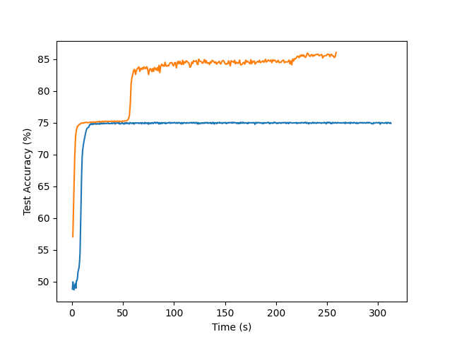
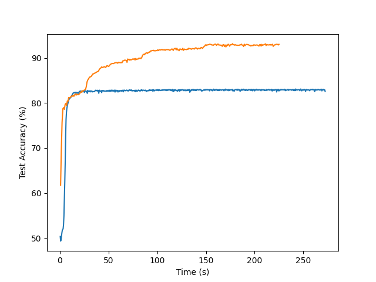
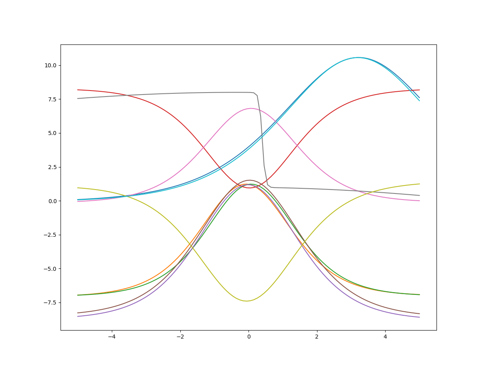
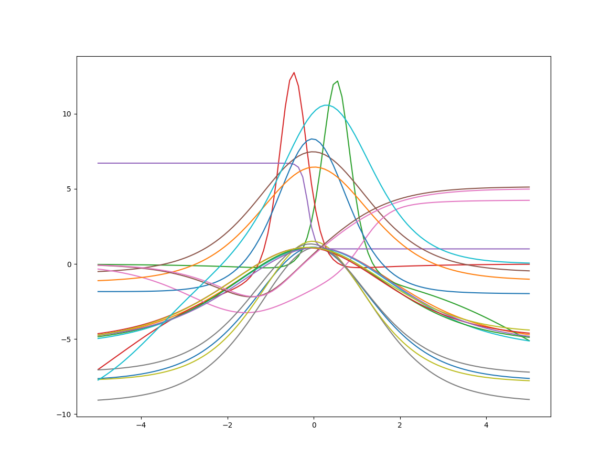

**Learning Non-Monotonic Activation Functions for Deep Neural Networks**

Independent Research Project by Jack DeLano

**Overview**

In this report, I propose a novel architecture for learning non-monotonic
activation functions in deep neural networks and present two experiments
performed to evaluate its performance.

**Background**

Gidon et al. (2020) discovered cortical neurons in the human brain with
activation potentials whose “amplitudes were maximal for threshold-level stimuli
but dampened for stronger stimuli.” They note that this non-monotonicity
“enabled the dendrites of individual human neocortical pyramidal neurons to
classify linearly nonseparable inputs—a computation conventionally thought to
require multilayered networks.” Perhaps evidence of non-monotonic activations of
neurons in the human brain suggests that such activations could be useful in
artificial neural networks. However, it is not obvious what non-monotonic
function(s) to use and which neurons in an artificial neural network should have
these activations and which should have traditional monotonic activations.

There has been limited research in learning activation functions for deep
learning. Agostinelli et al. (2015) proposed an adaptive piecewise-linear
activation unit, but the paper did not focus on non-monotonicity, and the
learned functions in practice appear to be slight variations of ReLU (i.e. not
non-monotonic in a significant/notable way).

**Proposed Model Architecture**

I propose the concept of a Learned Activation Layer (LAL) for deep neural
networks. Inputs to this layer are sent through a standard fully-connected
weight matrix to generate x, a vector of learned linear combinations of the
inputs (nothing new so far). Then, each node of the hidden layer gets its own
separately learned activation function hi:

hi(xi) = wi∙fi(xi) + (1-wi)∙gi(xi) , where

fi(xi) = sigmoid(wfi∙xi+bfi) and

gi(xi) = 4∙sigmoid(wgi∙xi+bgi)∙(1 - sigmoid(wgi∙xi+bgi)) .

The reader may recognize as a scaled version of the first derivative of the
sigmoid function, i.e. a bell curve with maximum value 1. This is exactly the
non-monotonic component of the learned activation function. So, on top of the
weight matrix for the fully-connected portion, the LAL has 5 additional
parameters per layer node: wi, wfi, bfi, wgi, and bgi.

This formulation for the LAL addresses the concerns alluded to in the Background
section, namely that we don’t initially know which neurons should have
non-monotonic activations and which should have monotonic ones, as well as what
those activations should look like. Through learning parameter wi, the model
learns what proportion of the final activation should come from fi(xi) (and what
remaining should come from gi(xi)). Through learning the other 4 parameters, the model
tunes the shapes of fi(xi) and gi(xi).

**Method**

In order to create a platform on which to test the performance of the LAL, I
implemented a custom module in PyTorch with computationally efficient forward
and back-propagation algorithms, achieved through mathematical simplifications
in the gradient formulas for gi(xi). The custom module appeared to be more efficient
than leaving the backpropagation entirely to PyTorch’s standard autograd
package, for training networks of sufficiently large size.

I integrated the LAL module as the first hidden layer of a neural network used
for classification. The network had an input layer, 2 hidden layers (again, only
the first one was a LAL), and a softmax output layer. Other than the LAL, the
other layers used the standard sigmoid activation function. For the remainder of
this report, this will be referred to as the learned-activation NN architecture.

For comparison purposes, I implemented another neural network, which was the
same as the learned-activation NN, except that the LAL was replaced by a
standard layer with a sigmoid activation function. This will be referred to as
the classic NN architecture.

All training was done on a machine running a fresh installation of Linux Mint,
utilizing a Nvidia GTX 1080 Ti.

**Data**

This section describes the generation of the train and test datasets. The data
is composed of two classes, which for simplicity I will call red and blue.

First, 100,000 25-dimensional gaussians were randomly defined for each class,
where the means were uniformly distributed within a 2x2x...x2 hypercube centered
at the origin, and the covariance matrices were diagonal with individual entries
uniformly distributed on [0.01, 0.1]. This defines the distribution of the data,
which can be thought of as a 25-dimensional box filled with 200,000 red and blue
polka-dotted regions of various shapes and sizes.

Next, for each of the 500,000 generated data points, a gaussian was selected
uniformly at random and sampled according to its distribution. The data points
were then separated 75%/25% into train and test datasets.

**Experiments**

I performed two experiments to compare the performances of the
learned-activation and classic NN architectures on the generated dataset. The
first experiment was performed with hidden layer dimension (hid_dim) =10 and the
second with hid_dim=20. For each, I performed grid search on the classic NN to
find the best values for its learning rate (lr) and SGD batch size (batch_size).
Each combination of hyperparameters was given 30 seconds to train, after which
its performance was evaluated on the test set. The grid search was stopped after
a fixed time, rather than after a fixed number of epochs, because different
values of batch_size required different amounts of time to complete each epoch.
For possible values of lr {0.3, 0.5, 0.8, 1.2, 1.5, 2.0, 2.5} and possible
values of batch_size {8000, 10000, 12000}, the classic NN with hid_dim=10 had
the best performance after 30 seconds with lr=0.8 and batch_size=8000, and the
classic NN with hid_dim=20 had the best performance after 30 seconds with lr=0.8
and batch_size=10000. Both the classic NN and learned-activation NN were trained
using these hyperparameter values with cross-entropy loss and SGD with
momentum=0.65. Their accuracies on the train and test datasets were evaluated
and recorded every 10 epochs.

**Results**

In Figures 1 and 2 below, only the accuracy on the test dataset is plotted,
since the train accuracy was nearly exactly the same and only served to make the
graphs harder to read. We see that the learned-activation NN reaches a higher
test accuracy than the classic NN in the cases of both hid\_dim=10 and
hid_dim=20. In fact, the learned-activation NN with hid_dim=10 even outperforms
the classic NN with hid_dim=20.

**Figure 1.** Test accuracy of classic NN (blue) and learned-activation NN
(orange) over time for hid_dim=10.

**Figure 2.** Test accuracy of classic NN (blue) and learned-activation NN
(orange) over time for hid_dim=20.

In Figures 3 and 4 below, the learned activation functions are plotted for each
node in the LAL. We can see that the networks learn a nice variety of activation
functions.

**Figure 3.** LAL learned activation functions for hid_dim=10.

**Figure 4.** LAL learned activation functions for hid_dim=20.

**Conclusion**

LALs show promising results for training accurate models with a relatively small
increase in parameters. Future research could evaluate the performance of LALs
on differently distributed data, on higher-dimensional data, with
higher-dimensional hidden layers, in different configurations within the overall
network, and in combination with non-LAL hidden layers that use non-sigmoidal
activation functions (e.g., ReLU).

References

>   Gidon, Albert, et al. “Dendritic Action Potentials and Computation in Human
>   Layer 2/3 Cortical Neurons.” *Science*, vol. 367, no. 6473, 2020, pp.
>   83–87., doi:10.1126/science.aax6239.

>   Agostinelli, Forest, et al. “Learning Activation Functions to Improve Deep
>   Neural Networks.” *arXiv*, 21 Apr. 2015, arXiv:1412.6830v3.
